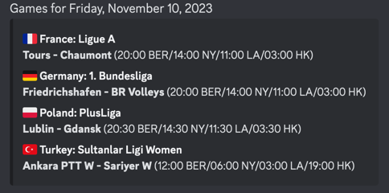

# Serve

Get the schedule your favourite volleyball leagues straight to your discord channel of choice.

The outcome looks as such:



## Deployment

```bash
brew install flyctl

flyctl auth login

fly launch

# set env variables
fly secrets set API_KEY=<flashscore-api-key>                                                                                                                        
fly secrets set DISCORD_URI=<full-discord-uri>
fly secrets list

# run only one container to execute CRON only once
fly scale count 1

# update running app
fly deploy
```

## Testing

There's a skipped test in `discord/discord_test.go` if you want to check that the discord message gets properly.
formatted

## TODOs

- use `"NAME_PART_1"` & `"NAME_PART_2"` from flashscore response for country/league struct